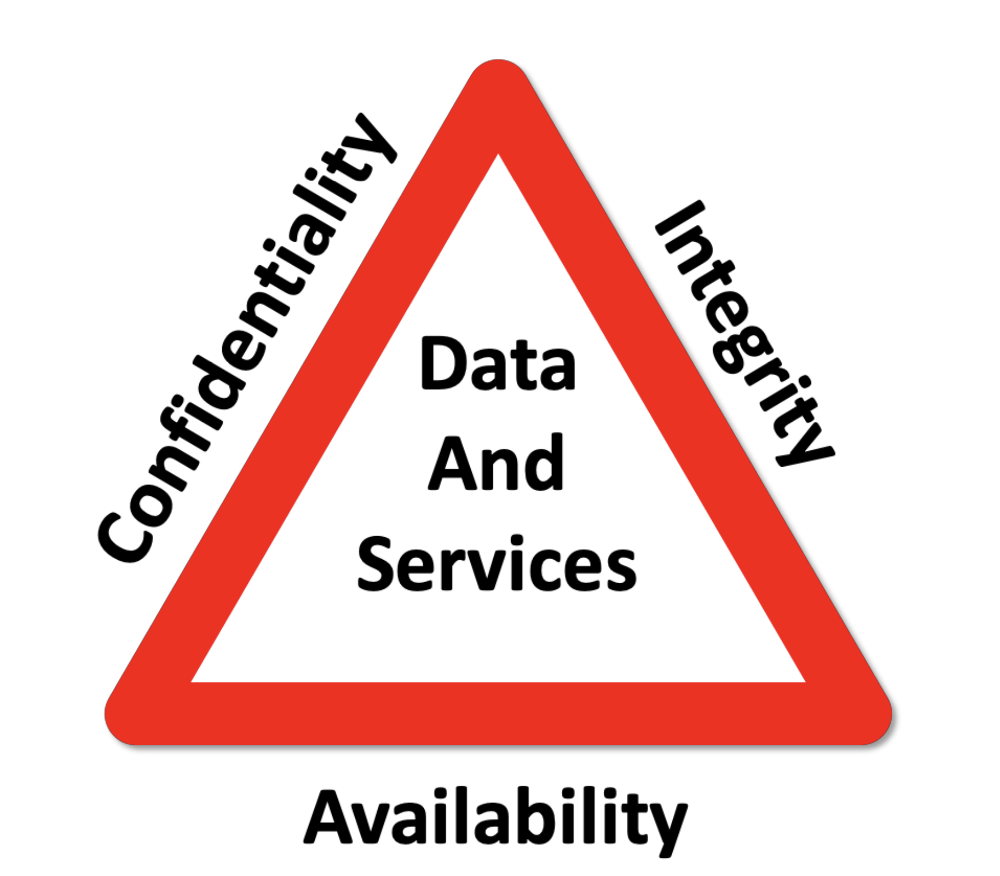
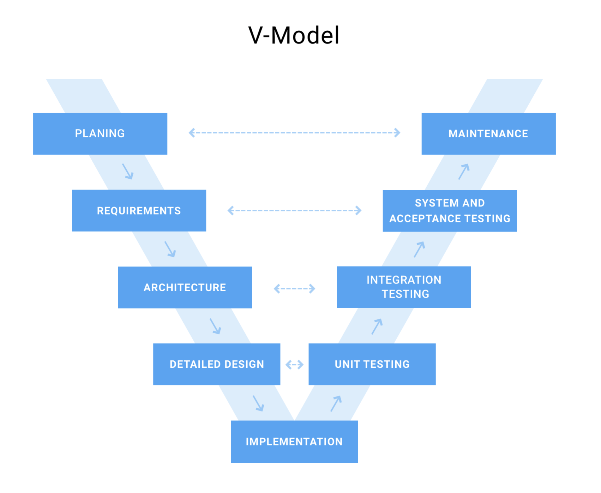

#### CIA Triad 
The CIA stands for **Confidentiality, Integrity and Availability** triad. The model is a well known design used to identify security problems, along with necessesary solution for information security. Even though the name is also used for the **Central Intellegence Service**, the triad have nothing to do with the agency.

**Confidentiality**
Confidentiality is based on enforcing certain access levels. Sometimes it involve seperating information in collection organized by who needs access to them. To try and prevent unauthorized access to sensitive information.

Some *solution* for this could be access control list, Volumes, File encryption and Unix file permissions. In Databases, solutions could be Authorization and data seperation.

**Integrity**
Integraty is about insuring data from being deleted and modified by any unauthorized party. It also insures that when authorized person delete or modifies information, and something goes wrong, information can be reserved.

This can be handled by rollbacks in Relational-Databases.

**Availability**
This is about the information being available when needed. Protecting and insuring data should not prevent access to authorized people. High availability is crutial for any system and company. 

### V-Model
The V-Model also known as Validation and Verification Model, is perfect for illustrating what test approaches there are for different development stages. 

This model have two cycles. 
* SDLC ( Software Development Life Cycle )
* STLC ( Software Testing Life Cycle )

#### Software Testing Life Cycle
**Unit Testing**
Unit testing can be used for both the UI and source code. And is usually a process where we test the output to what we expect to be the correct value. And based on the result either fail or pass.

**Integration Testing**
Integration Testing is combining multiple Unit Test as a group. The reason for that is to test the interaction between integrated units. 

**System Testing**

* Acceptance Testing

| Level/Type | Functional | Operational | Developmental|
|-|-|-|-|
|Unit | | | |
|Component| | | | 
|Integration| | | | 
|System| | | |
|Acceptance| | | |

#### Testing to critique
###### Specifications as Tests
###### Verification
###### Validation
#### Testing to Support
###### Requirements as Tests
###### Test Driven Development
###### Characterization tests

### Robustness
* Defensive programming
* Encapsulation 
* Complexit
* Murphy 

### Tests 
* Test Types
* Test Levels

### What is Robustness 
###### Fault tolerant 
###### Graceful shutdown
###### Meaningful feedback on errors 
###### Recoverable

#### How to obtain robust code 
###### Require your preconditions to hold 
###### Ensure your postconditions to hold
###### Defend your gates against intruders
###### let no spies get out 

#### Hide information
###### Use the language's build in incapasulation mechanism
###### Or trick the language to hide the information
###### Width no walls, defending the gates alone is not very effective 
###### Never reveal your weaknesses

#### Reduce Complexity 
###### Bundle parts of code with highe cohesion
###### Decouple bundled parts
###### Be sure that your units are well organizaed and cooperating 
###### Dont let unit's defeat/loose the battle

#### Expect the impossible 
###### Remember Murphy's law...

